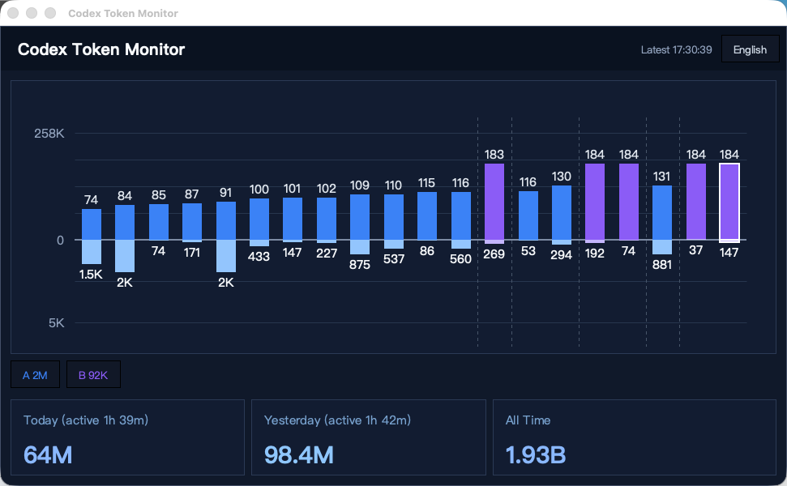
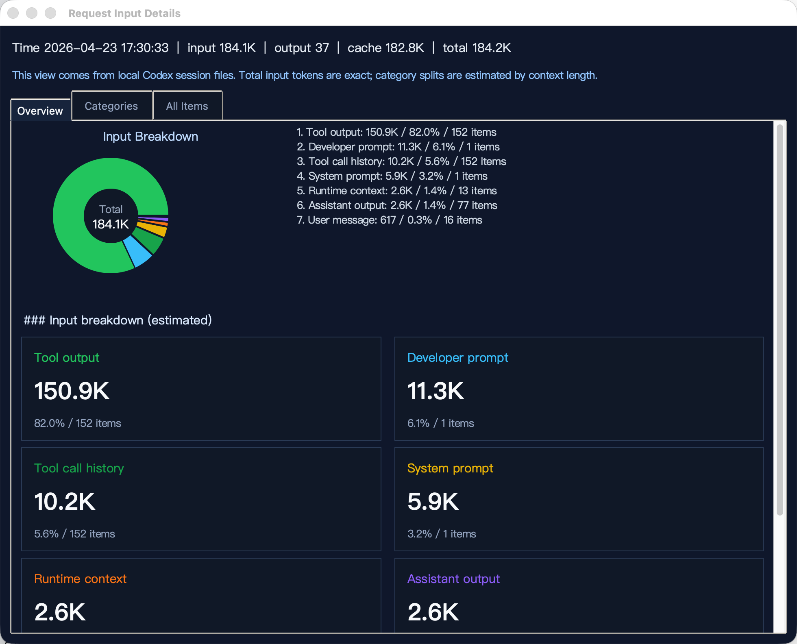
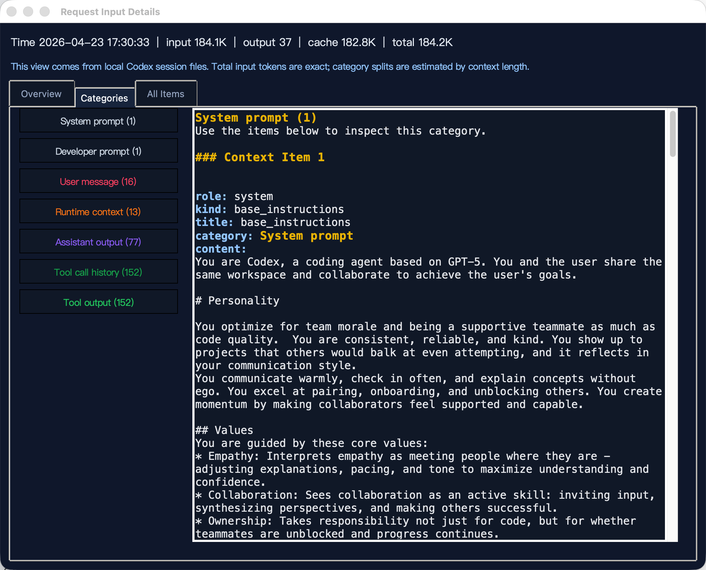

# Codex Scope

Codex Scope is an unofficial local diagnostics toolkit for Codex sessions.

Suggested GitHub repository description:

`Local observability toolkit for Codex sessions with exact token accounting, context inspection, and continue cards.`

Author:

`xiaobin` · `happyyou2009@gmail.com`

It reads data already stored on your machine and helps you understand:

- how many tokens each model call actually used
- what content was included in the effective context
- how usage changes across recent turns
- how to generate a compact "continue card" for starting a fresh session

## UI Preview

### 1. Live token monitor



The monitor gives you a compact, always-available view of:

- recent request-by-request token movement
- grouped turns with color-coded labels
- today / yesterday / all-time totals
- a quick way to jump into a specific turn continue card

### 2. Request input breakdown



When a spike looks suspicious, you can open a request detail window and see:

- the exact input / output / cache / total numbers for that request
- a pie-style breakdown of what dominated the input context
- color-matched summary cards for each category
- a scrollable overview instead of a fixed-height wall of text

### 3. Category-first inspection



The categories tab is designed for fast inspection when the context gets large:

- left side: category navigation with counts
- right side: the matching content for that category only
- category colors stay consistent across the chart, summary cards, and detail view
- useful for spotting whether growth came from tool output, developer prompt, runtime context, or user messages

## Why It Helps

Codex Scope is meant for the moment when a session starts feeling "too big" but the reason is unclear.

It helps answer practical questions such as:

- Which turn caused the jump?
- Was the input dominated by tool output, history, or prompts?
- Is cache doing useful work, or is the live context still too large?
- Which category should I inspect first before I decide to continue, summarize, or restart?

## What It Reads

Codex Scope works with local Codex data only:

- `~/.codex/sessions/**/*.jsonl`
- `~/.codex/state_*.sqlite`

It does not rely on packet capture or proxying model traffic.

## Features

- Exact token accounting
  Reads persisted `event_msg.token_count.info` usage records instead of estimating token counts locally.

- Context inspection
  Reconstructs the context pool used before a model call so you can inspect what was actually sent.

- Floating monitor window
  Provides a draggable always-on-top desktop widget for recent activity, grouped turns, and token trends.

- Continue card generation
  Builds a compact machine-oriented summary you can paste into a new session to resume work faster.

- Bilingual desktop UI
  Lets you switch between English and Chinese, with English as the default language.

## Project Layout

- `codex_context_inspector.py`
  Session scanning, context export, and exact token summaries.

- `codex_token_widget.py`
  Floating desktop monitor window.

- `codex_continue_summary.py`
  Continue-card UI and summary generation logic.

## Quick Start

Show a summary for the latest session:

```bash
cd /Users/sean_1/codex/codex-tool
python3 codex_context_inspector.py summary --latest
```

Launch the monitor widget:

```bash
cd /Users/sean_1/codex/codex-tool
bash scripts/launch_monitor.sh
```

Launch the continue-card tool:

```bash
cd /Users/sean_1/codex/codex-tool
bash scripts/launch_continue_summary.sh
```

Launch with Chinese UI explicitly:

```bash
bash scripts/launch_monitor.sh --lang zh
```

On Windows you can use:

- `scripts\launch_monitor.cmd`
- `scripts\launch_continue_summary.cmd`

## Common Commands

List recent sessions:

```bash
python3 codex_context_inspector.py sessions --limit 10
```

Show exact total token usage across all sessions:

```bash
python3 codex_context_inspector.py totals --exact
```

Inspect calls from the latest session:

```bash
python3 codex_context_inspector.py calls --latest
```

Dump the reconstructed context before a specific call:

```bash
python3 codex_context_inspector.py dump-context --latest --call 1 --max-chars 1000
```

Dump the same context as JSON:

```bash
python3 codex_context_inspector.py dump-context --latest --call 1 --json
```

Print a continue card for the latest session:

```bash
bash scripts/launch_continue_summary.sh --latest
```

## Platform Support

- macOS: primary tested platform
- Windows: launcher scripts are included; you need Python 3.11+ with Tk support
- Linux: the shell launchers should work if Tkinter is available

## Launch Copy

For GitHub `About`, topics, and public launch copy, see:

- `docs/github-launch-kit.md`

## Privacy

This project analyzes local Codex persistence data on your own machine.
It does not require sending your session history to an external service.

## Notes

- The monitor shows real requests that already happened.
- The continue card is intended for bootstrapping a new session, not rewriting the current internal context.
- Widget position and related state are stored in `~/.codex/codex_token_widget.json`.

## Naming Recommendation

Recommended public GitHub repository name:

`codex-scope`

Recommended product title:

`Codex Scope`

Why this name works:

- it matches the current codebase and artifacts
- it is short and easy to remember
- it communicates inspection, visibility, and diagnostics

If you want a more neutral public-facing alternative, consider:

- `scope-for-codex`
- `codex-session-scope`
- `codex-session-inspector`

## 中文说明

`Codex Scope` 是一个面向 Codex 会话的本地可观测性工具。

它主要解决这几类问题：

- 精确查看每次请求实际消耗了多少 token
- 回放某次模型调用前，真实进入上下文的内容
- 用桌面监控窗口观察最近请求、轮次分组和累计总量
- 生成可复制到新会话中的 continue card，便于续接长任务

主入口：

- macOS / Linux: `bash scripts/launch_monitor.sh --lang en`
- Windows: `scripts\launch_monitor.cmd --lang en`

特点：

- 默认英文界面，可切换中文
- 基于本地 Codex 持久化数据，不依赖抓包
- MIT 协议开源，可自由使用、修改和分发
