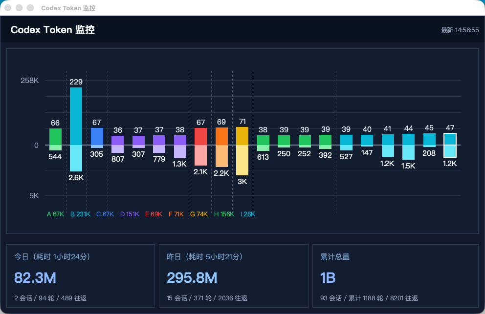

# Codex Scope

Codex Scope is an unofficial local diagnostics toolkit for Codex sessions.

Suggested GitHub repository description:

`Local observability toolkit for Codex sessions with exact token accounting, context inspection, and continue cards.`

It reads data already stored on your machine and helps you understand:

- how many tokens each model call actually used
- what content was included in the effective context
- how usage changes across recent turns
- how to generate a compact "continue card" for starting a fresh session



The screenshot above shows the English monitor dashboard with recent token activity, grouped turns, and a more detailed all-time total card.

## What It Reads

Codex Scope works with local Codex data only:

- `~/.codex/sessions/**/*.jsonl`
- `~/.codex/state_*.sqlite`

It does not rely on packet capture or proxying model traffic.

## Features

- Exact token accounting
  Reads persisted `event_msg.token_count.info` usage records instead of estimating token counts locally.

- Context inspection
  Reconstructs the context pool used before a model call so you can inspect what was actually sent.

- Floating monitor window
  Provides a draggable always-on-top desktop widget for recent activity, grouped turns, and token trends.

- Continue card generation
  Builds a compact machine-oriented summary you can paste into a new session to resume work faster.

- Bilingual desktop UI
  Lets you switch between English and Chinese, with English as the default language.

## UI Preview

- A floating desktop dashboard for recent token activity
- Daily, previous-day, and cumulative usage totals
- Grouped turn visibility for spotting spikes quickly

## Project Layout

- `codex_context_inspector.py`
  Session scanning, context export, and exact token summaries.

- `codex_token_widget.py`
  Floating desktop monitor window.

- `codex_continue_summary.py`
  Continue-card UI and summary generation logic.

## Quick Start

Show a summary for the latest session:

```bash
cd /Users/sean_1/codex/codex-tool
python3 codex_context_inspector.py summary --latest
```

Launch the monitor widget:

```bash
cd /Users/sean_1/codex/codex-tool
bash scripts/launch_monitor.sh
```

Launch the continue-card tool:

```bash
cd /Users/sean_1/codex/codex-tool
bash scripts/launch_continue_summary.sh
```

Launch with Chinese UI explicitly:

```bash
bash scripts/launch_monitor.sh --lang zh
```

On Windows you can use:

- `scripts\launch_monitor.cmd`
- `scripts\launch_continue_summary.cmd`

## Common Commands

List recent sessions:

```bash
python3 codex_context_inspector.py sessions --limit 10
```

Show exact total token usage across all sessions:

```bash
python3 codex_context_inspector.py totals --exact
```

Inspect calls from the latest session:

```bash
python3 codex_context_inspector.py calls --latest
```

Dump the reconstructed context before a specific call:

```bash
python3 codex_context_inspector.py dump-context --latest --call 1 --max-chars 1000
```

Dump the same context as JSON:

```bash
python3 codex_context_inspector.py dump-context --latest --call 1 --json
```

Print a continue card for the latest session:

```bash
bash scripts/launch_continue_summary.sh --latest
```

## Workbuddy Setup

If you want teammates to launch Codex Scope from Workbuddy, use the monitor as the main entry point.

Recommended Workbuddy configuration on macOS and Linux:

- Working directory: the repository root
- Command: `bash scripts/launch_monitor.sh --lang en`

Recommended Workbuddy configuration on Windows:

- Working directory: the repository root
- Command: `scripts\launch_monitor.cmd --lang en`

If Python is installed in a non-standard location, set this environment variable in Workbuddy:

```bash
CODEX_SCOPE_PYTHON=/path/to/python
```

Example:

```bash
CODEX_SCOPE_PYTHON=/opt/homebrew/bin/python3.13
```

Why this works:

- Workbuddy does not need to know project internals
- it only needs one stable main entry command
- the launcher script auto-detects Python instead of relying on a hardcoded path

Launcher priority order:

- `CODEX_SCOPE_PYTHON`
- `.venv/bin/python`
- Homebrew Python
- other non-system `python3`
- fallback `python`

Troubleshooting:

- If Workbuddy reports a Python startup failure, do not call `python3 codex_token_widget.py` directly.
- Use the launcher script instead: `bash scripts/launch_monitor.sh --lang en`
- For GitHub distribution, the shell and Windows launchers are the recommended entry points.

## Platform Support

- macOS: primary tested platform
- Windows: launcher scripts are included; you need Python 3.11+ with Tk support
- Linux: the shell launchers should work if Tkinter is available

## Privacy

This project analyzes local Codex persistence data on your own machine.
It does not require sending your session history to an external service.

## Notes

- The monitor shows real requests that already happened.
- The continue card is intended for bootstrapping a new session, not rewriting the current internal context.
- Widget position and related state are stored in `~/.codex/codex_token_widget.json`.

## Naming Recommendation

Recommended public GitHub repository name:

`codex-scope`

Recommended product title:

`Codex Scope`

Why this name works:

- it matches the current codebase and artifacts
- it is short and easy to remember
- it communicates inspection, visibility, and diagnostics

If you want a more neutral public-facing alternative, consider:

- `scope-for-codex`
- `codex-session-scope`
- `codex-session-inspector`
